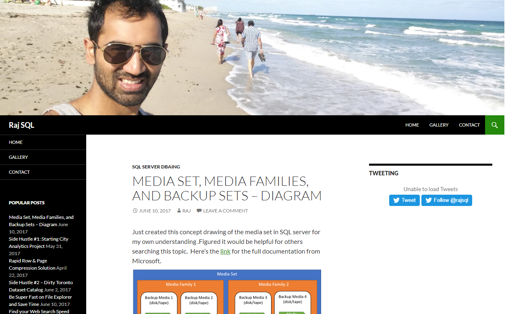

## Humble Beginnings
For most of us, a blog is about sharing ideas, helping others, and gaining online presence. It's a conversation starter and a network builder. A year and half ago, I had the aspiration of starting my own blog. I did using Wordpress at _RajSQL.com_. WordPress is great place to start, but as a software developer, I wanted more control over the look and feel of my website. I also wanted the management of posts to be simple. After writing some posts on WordPress, I stopped because the experience felt clunky and unoriginal.  

## Overkill
A few months ago, I was reminded the importance of blogging as a software developer. Remembering my past attempt with WordPress, my initial instinct was to build a 2-tier or 3-tier web application with all the bells and whistles like databases, web API, and client side rendered user interface. Looking in hindsight, it was over ambitious for my situation. In my perspective, trying to build something large and complex without proof of its demand is highly risky. Rather, I decided to start really small and expand in an iterative and incremental way. I did so by quickly hashing up a static client-side rendered webpage. Ortmesh 1.0.

## Client Side Rendering Only?
In comparision to WordPress, the site used secure HTTPS and it loaded extremely fast because of the edge caching provided by AWS CloudFront. Cost of running it were very minimal. Navigation was really quick and fluid. Site felt clean and fresh
because of modern UI frameworks like Semantic UI. 

There were a few issues with this setup: 
* _Unoptimized SEO_ - Since all the pages, including blog posts, were generated from JavaScript off the initial load on the client browser, search engine crawlers were going to have trouble indexing them correctly. This would reduce the discoverability 
of my content.
* _Inflexible Routing_ - I was unable to serve my blog posts directly via URL 
because I was using a static web server. Since my app was a single page app, the server could only respond by serving the homepage. That would mean users or I were unable to bookmark specific pages.
* _Initial Loading_ - while the site navigation _between_ pages was fast, the initial load was to long for a simple site like mine. If you were on a slower device with weaker internet connection, you would see flash of ugly content or a blank screen before the site comes up a second or two later.            

## Universal is Overkill 
This issues led me to consider building a universal or isomorphic app. This setup would enable my site to be rendered on the server initially, and then be handed over to the client browser for subsequent page requests. I would be getting the benefits of server side rendering and client side rendering, and it would supposedly solve all my problems.

The two biggest deterrent were:
* _Cost of ownership_ - Running the smallest VM 24/7 with a content delivery network (CDN) would cost more around 150$ CAD a year. A static website would be less than tenth of that.     
* _Effort to Develop & Maintain_ -  The other issue was that developing the infrastructure and application to support a starting blog site was excessive. It would take my time away from blogging and working on other cool side projects.

Despite these trade-offs, I went ahead and tried to build a small prototype but found the setup very time consuming and complex to be worth it. So I started looking for alternatives.       
    
## Hello Gatsby
I was searching for a way to scale the building of optimized static webpages using data provided from a database, file, or metadata. What I actually needed was a static site generator. Upon learning of all the ones available in the wild, I went with Gatsby because I had experience with React and GraphQL. 

Gatsby falls into the category of static rendering. All the content and pages are generated at build time. It produces a unique HTML page for each URL ahead of time, instead of building one dynamically like in server side rendering. 

Here're some advantages I found using Gatsby:
* It's cheap because I don't need an application server. A static web server is enough, such as Amazon S3 + CloudFront.
* I don't repeat code. GraphQL queries and lifecycle hooks help me inject data into generic templates to build
the web pages.
* The routing is handled server side but its blazing fast because of client side caching and edge-caching 
* SEO is maximized. Every route generates a full HTML page with the whole metadata for crawlers to chew on. 
* Adding post is simple as writing some markdown and adding links to images. Low maintenance.

The only drawback is that every change requires a deployment, however that won't be an issue because the content is not change frequently enough. 

## Conclusion
The blog site is not much but I'm very pleased with the results so far and I'm looking forward to posting some decent content.   
