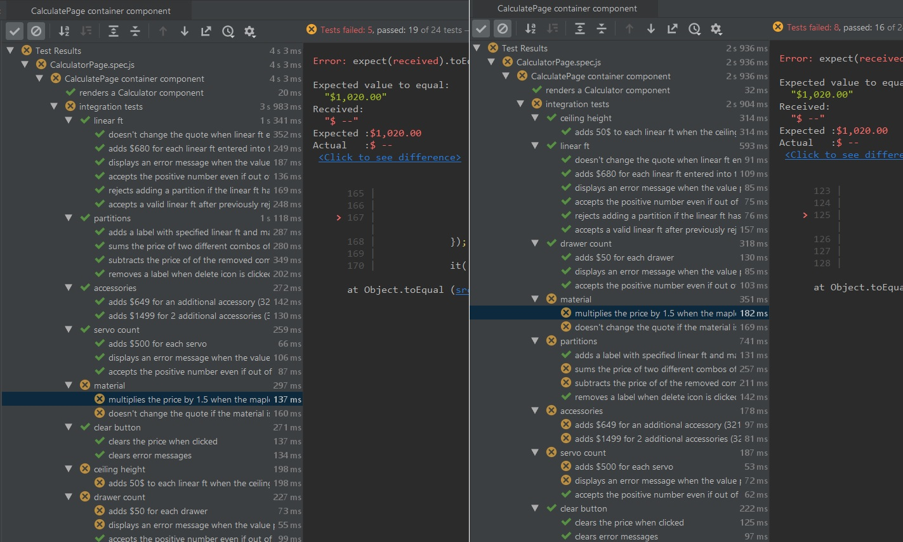
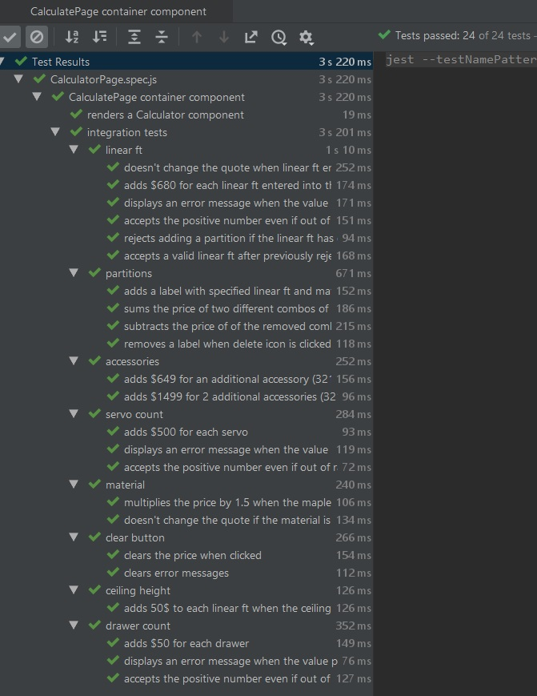

## Introduction
Integration tests helps test groups of interconnected components of software. 
In contrast, unit tests aim to test single units of code. 
Ideally, unit tests are written before integration tests and both tests are written before writing any working code. 
The reason we test is to prevent <a href='https://en.wikipedia.org/wiki/Software_regression' target='_blank'>regression</a>, 
which happens when code stops working as intended as new features are added or old features are fixed. 
They act as safety nets when making modifications to complicated systems. 
Because integration tests combine multiple modules together, they can be complicated to get right. 
In this post, I'm sharing one interesting issue I faced while writing integration test for a 
<a href='/kitchen-quoter' target='_blank'>side project, Kitchen Quoter</a>. 

## The Problem
When I was writing integration tests in Jest, I initially assumed that my test would be isolated from each other.
After adding a few, I realized my tests would start failing unpredictably. Out of curiosity, I discovered a different
set of tests failing when I reordered them. 
Changing the order shouldn't affect the results, unless there was a common dependency.   

 
 _Reordered my tests. Got different result. What?_

## The Solution
After searching the web, I found a <a href='https://github.com/facebook/jest/issues/1224' target='_blank'>Github issue</a> 
that clarified the issue. The issue is a _leaky_ or _dirty_ _JSDOM_ (JavaScript Document Element Object).
Browsers use a _DOM_ to display web pages. 
I was using Jest and Enzyme's `javascript>mount()` to create an in-memory _DOM_ for testing.
Here's the code that ran before each integration test:      
```javascript
// CalculatorPage.spec.js
beforeEach(() => {
    history = createMemoryHistory();
    store = configureStore(history, initialState, false);

    wrapper = mount(
        <Provider store={store}>
            <ConnectedRouter history={history}>
                <Routes/>
            </ConnectedRouter>
        </Provider>);
});
```

To my surprise, the _JSDOM_ doesn't reset after each test and the only workaround is to:
1. create a separate each test per file
2. write code to manually clean up the JSDOM

The Jest team confirms it's for performance reasons. 
Sadly, resetting of the JSDOM is an expensive operation. 
It adds too many milliseconds to each test.

## Workarounds
With these workarounds, the developer has to be extra careful when designing their test suites. Let's consider our options.
#### Seperate files
One the one hand, separating out each test per file could become unmanageable.
With 30+ tests, that could mean 30+ files. 
With multiple files that test a related component, we would need to develop a naming convention that makes it easy and quick to find a specific test.
Also, more files would result from refactored code that is shared amongst the test files (i.e. beforeEach).  

#### JSDOM Cleanup
In a single test file, we can organize tests using `describe()` and `it()` blocks. 
This helps speed up navigation b/w tests using rich IDE features like code folding. 
It also makes test reports easier to read and cohesive because they are clustered with the component under testing.
The biggest risk is writing **faulty clean up code**, which leads to incorrect tests. 
The code for resetting the JSDOM has be to be correct. 

For my project, I luckily have a _Clear_ button that resets the Redux-managed state of my calculator form. 
Once I'm assured the button resets the Redux state correctly, I used it in my `javascript>beforeEach()` as shown below:

```javascript
// CalculatorPage.spec.js
beforeEach(() => {
    history = createMemoryHistory();
    store = configureStore(history, initialState, false);

    wrapper = mount(
        <Provider store={store}>
            <ConnectedRouter history={history}>
                <Routes/>
            </ConnectedRouter>
        </Provider>);
    wrapper.find('button[id="clearQuote"]').simulate('click'); // highlight-line
});
```

With that in place, my integration test all pass when they're run together.
 
 
 
## Conclusion
So far, I've chosen to clean up the JSDOM exclusively rather than separate out the tests into multiple files.
Refactoring my test file into multiple files in inevitable as my file grows and I will have to adapt an hybrid solution
b/w the two workarounds. My approach to resetting JSDOM, or even handling this issue entirely may not be the ideal, 
but I'm focused on making the software work initially and improving the code over time iteratively.
  
     
 
