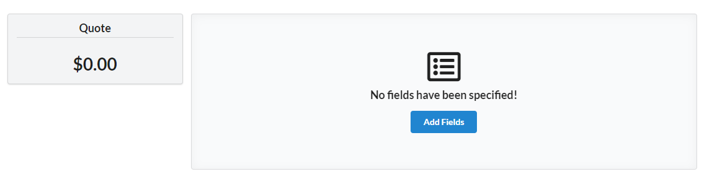
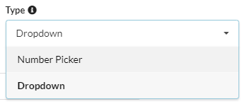
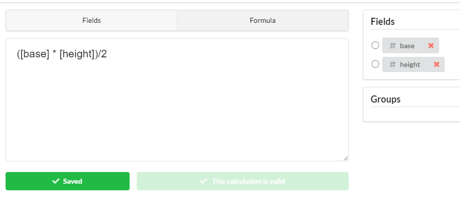

    <i class="linkify icon"></i>
    

        
Related Links

        <ul class="list">
            <li><a target="_blank" href="https://d3c237k00uyj5k.cloudfront.net/">Live demo! Try it out!</a></li>
            <li>Read my <a target="_blank" href="//ortmesh.com/abstracting-kitchen-quoter">previous </a>or my 
            <a target="_blank" href="//ortmesh.com/kitchen-quoter">original</a> post on the kitchen quoter</li>
        </ul>
    

### The 3-Step Process
The main objective of the app is build a customizable calculator for generating quotes on the fly.
This involves a 3 step process: 
1. Create calculator fields or parameters specific to a use-case 
2. Specify an formula or function, which includes mathematically combining the fields from Step 1
3. Entering values in the designed calculator to generate a quote

A very basic example is calculating the area of a triangle. Here's the 3 step process applied to this use-case:
1. Enter in `base` and `height` as the calculator fields for input
2. Specify `(base * height)/2` as the formula to apply
3. Change the base and height values in the calculator to see updates to the area
  

        

_Demo_

  
### It's Not Intuitive Enough
One comment was that the 3-step process is not obvious enough. After the initial page loads, the 
user is directed to create the fields but the process after that is not clear. The _Why_ and the _How_ for each of the  
steps isn't clear within the app itself.

_More hints like these_

To fix this, I should create more messages and notifications to hint the new users for next steps.
Adding a progress bar or a small workflow overview may improve the experience. The main idea is to walk the 
new user through the process successfully at least once.

### Field Types

_Picking field types in Step 1_

There are two ways of entering data into the calculator. The first is the _Number Picker_ where a number is specified within a range. 
For example, the _Number Picker_ can be the age. Second type is _Dropdown_ which involves selecting single or multiple options from a set.
An example of a field with options is color, which involves selecting from a list of colors. 

The problem is that
the labels, _Number Picker_ and _Dropdown_, aren't descriptive or accurate enough for users to initially understand 
their difference in use.
Perhaps, the labels need to be reworded, or better inline documentation should be added.

### Formula Building
The interface for entering the formula is very crude right now.
  

_The interface for entering in the formula (Step 2)_

Some things that can boost the usability in the future:
* Drag and drop of the fields into the text area. Right now, the field has to be clicked for it to be populated into the textbox
* When field is clicked, the field token (in square brackets) should be added at the cursor position. Right now, it appends to the end of formula.
* Autocomplete the field name when user begins typing it out
* Syntax highlighting to make it easier to read

### Bundle Size
Because this is client-side rendered Single Page App (SPA), the bundle size should stay small (< 244 kb). 
Unfortunately, the bundle size is 1.4 Mb, which is 5x larger than target. 
<a href="https://react.semantic-ui.com/" target="_blank">Semantic UI CSS</a> and 
<a href="https://mathjs.org/" target="_blank">MathJs</a> are 2 JavaScript libraries are consuming 80% of the 1.4 Mb
bundle sizes. The size is large because the whole library, including unused bits, are being imported into the build
output. With Semantic UI CSS (used for styling), I've tried using PurgeCSS to strip unused CSS but this approach
has failed in my last few attempts. For MathJs, the library doesn't support ES6 imports, so the 
<a href="https://webpack.js.org/guides/tree-shaking/" target="_blank">tree shaking</a>
feature of webpack isn't applied as expected. I'm still researching for fixes and/or alternatives.

 ### Conclusion
I've completely finished abstracting the calculator away from a single use-case. Next steps 
include tweaking the existing design to improve usability. Also, the size of the production build needs be less than 250kb for 
better performance. If what I build looks promising, I will develop the backend to support persistence and user auth.      

