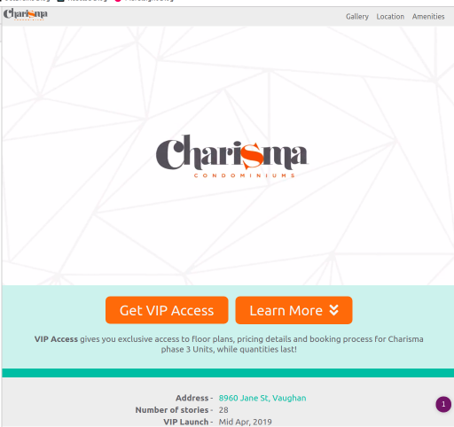
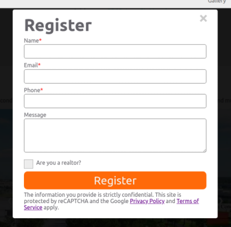

<div class="ui icon info message">
    <i class="linkify icon"></i>
    <div class="content">
        <div class="header">Related Links</div>
        <ul class="list">
            <li><a href="https://dgftd2qqywjy1.cloudfront.net/" target="_blank">Link to the Landing Page</a></li>
            <li><a href="https://github.com/rajjeet/charismacondos" target="_blank">Codebase on Github</a></li>
        </ul>
    </div>
</div>


## The Opportunity

Real estate agents, from my family and acquaintances, recently asked me to build them a landing page on short notice. The landing page was intended for generating leads on new condo developments in Vaughan. The goal was to collect emails and phone numbers of interested buyers.

Landing pages are the primary web pages that users land on after clicking a link from social media, ad, or search result. The purpose of these web pages vary, but the overarching goal is to provide info to drive business (i.e convert visitors into customers). The desired action is the _Call to Action (CTA)_ and the success rate of the CTA is the _conversion rate_.

Building a landing page for a single use case isn't that difficult. All one needs is HTML/CSS/JS uploaded to a static hosting service and a server to handle API requests generated by the user. The difficult part is going from varying requirements to production in an hour. Why so fast? Because landing pages for real estate are time sensitive for three reasons:  
1. Web pages are only needed while the property is on the market
2. Media (i.e. pictures, videos) are only available right after the property enters the market
3. Every day counts

Many more landing pages for future condo projects and individual real estate listings will be needed in the future, so this wasn't a one time ask. Knowing this, I decided to build a developer-friendly process for churning out quality production-grade landing pages at a rapid rate.

## Understanding the Requirements
In order to delivery production-grade landing pages fast, I came up with the following requirements before starting:
* Responsive to mobile, tablet, desktop clients
* Search engine optimized - include all meta data needed for crawlers and ideal keyword usage
* Offline support - website is cached on client browser on initial load and available without network
* Keep total cost of ownership under $20
* Build using reusable components (DRY Principle) 
* JavaScript bundle size under 170k - only include used components and code
* Components are highly customizable
* Lazy loading of media files 
* Use a content network delivery for low latency and cost
* Do everything serverless - pay per usage model 
* Automate the build and deploy process    

## Current Solution
The first landing page I built was for Charisma Condos Phase 3 near Vaughan Metropolitan Centre. <a target="_blank" href="https://dgftd2qqywjy1.cloudfront.net/">Here's the link to the site on a CDN.</a>

For the infrastructure, here's the reference architecture from AWS CloudFormation:


<a href="https://github.com/rajjeet/charismacondos/blob/master/aws/template.yaml" 
target="_blank">Here's the link to AWS CloudFormation yaml script corresponding to the diagram above</a>

### Storage and Hosting
The website, which consists of simple HTML/JS/CSS is hosted on AWS S3 static website hosting. Public access to S3 content is restricted, so the content is only accessible through a CDN called AWS CloudFront. CloudFront provides edge caching. This meaning it copies the content from S3 (origin) to cheap, redundant servers all over North America and Europe. Using a CDN to serve the content saves cost (avoid hitting S3), reduces latency, boosts security, and protection against Denial of Service (DoS) attacks. 
<span style="background-color:lightyellow;">The website is deployed on a <em>S3 Bucket</em> and 
provided through the <em>CloudFront Distribution</em>.</span> 

### Backend
The website allows users to register for VIP access to get floor plans and pricing details from realtors via a register form. This is the registration form: 


Once the user submits this form, a HTTP POST request is fired to the AWS API Gateway, a serverless API access point. The request is routed to a AWS Lambda, a serverless function that processes the request.
This includes: 
1. Verifying a token generated by reCAPTCHA to prevent bot spamming
2. Sending an email to the realtors with the submitter's info  

<a target="_blank" href="https://github.com/rajjeet/charismacondos/blob/master/aws/index.js">
Here's the Lambda code written in JavaScript.</a> Based on future needs, I can extend this functionality to send users a response email/document and to persist the data.

### User Interface
<a target="_blank" href="https://www.gatsbyjs.org/">GatsbyJS</a> is a ReactJS-based static website generator used to produce the production quality HTML/JS/CSS. 
The components of the landing page are reusable React components, complimented with custom CSS.Here are the key components for this particular landing page:

```javascript
    <HeroBanner/>
    <Specs />
    <PhotoGallery/>
    <Location/>
    <Banner/>
    <Amenities/>
    <FooterContact/>
```

Each component has it's own encapsulated CSS file and they share cross-cutting code (i.e. site theme, simple functions). With the functionality of tree shaking, the production build only consist of used code. This means that I can continue to evolve the component library for future landing pages, without worrying about inflated JavaScript bundle size. For each landing page request, I can pull in the necessary components and modify the text and theme.

Using Gatsby's image plugin, I'm able to lazy load all the images automatically. Thanks to Gatsby, code cutting of JavaScript bundle is automatic. The big JavaScript bundle is split into many chucks and only the needed ones are loaded, reducing bandwidth and loading time. Also, all the links on the page are prefetched. This means resulting pages of all links on the loaded page are downloaded asynchronously into the client browser. This makes navigation blazing fast.

Using React and GatsbyJS increases the maintainability of the codebase. This solution allows quick edits to generate entirely new landing pages. When existing components are not suitable, new ones can be created and reused for future work. Lastly, everything is customizable because it's just JavaScript and CSS.

### Development and Deployment
In the `package.json` file, there are multiple npm commands to streamline the whole process.
* `npm start` starts the development process - includes live updates 
* `npm run prod`  produces a production build and serves it on a local port for basic testing
* `npm run aws:package` transform the AWS Serverless CloudFormation template into a deploy friendly version
* `npm run aws:deploy` deploys the serverless AWS infrastructure necessary to serve the website and handle the API calls
* `npm run aws:publish` transfers the production build to S3 bucket

Note: I'm missing the automation code/command for deploying the domain name and SSL certificate. This is needed to serve the CDN content via a domain name using HTTPS.
