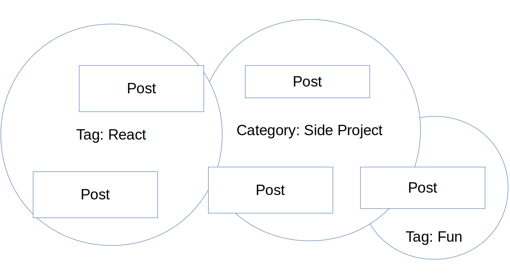
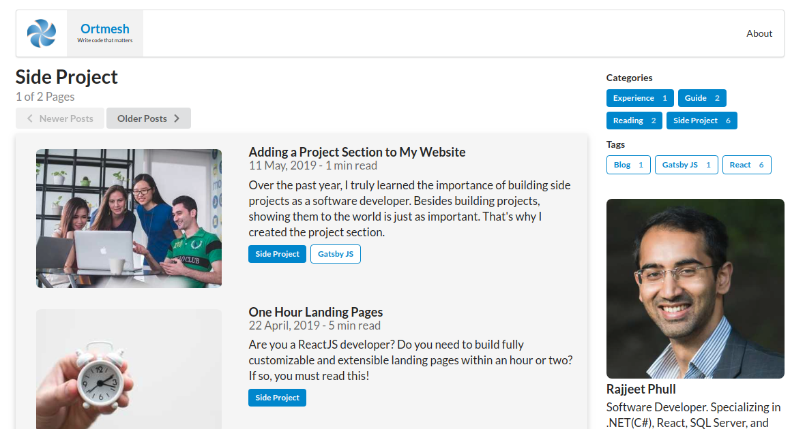
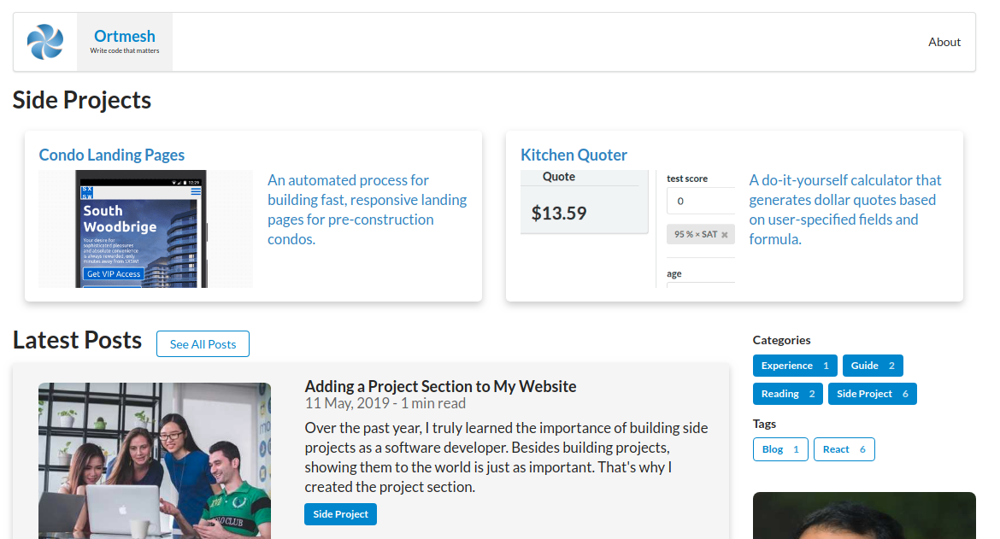
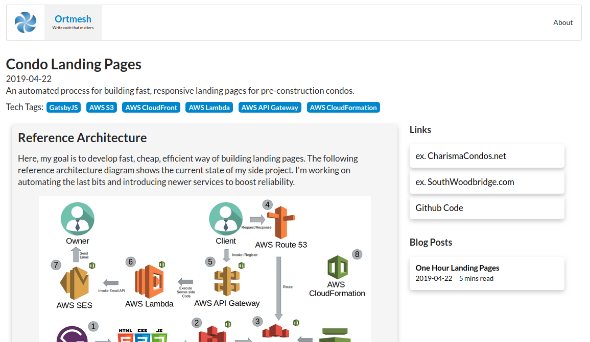

## Original Intent
My original intent was to connect related blog posts using categories and tags. 
The problem is when content accumulates and varies by topics, it becomes difficult to highlight the important things.
Side projects is one of those important things. 

_Recent organization of my blog posts, grouping by tags and categories_

### 1 Post Per Project?
I thought of having 1 blog post per side project, but I find updating older posts masks the progress of the work.
Besides, it's easier and exciting to start fresh. 
But writing multiple posts for a side project means either repeating or referencing content in every post.
Also, having multiple posts sprinkled over time and mixed with other posts makes it harder to highlight the big picture.  

It's not interesting or intuitive seeing a list of projects related by a single word. 
It's nicer to have context around a set of posts. 
It makes the individual posts easier to understand, and allows me to write individual posts with more depth and meaning.

### Context for Each Category and Tag
I was contemplating adding content for each category and tag. 
Right now, each category and tag has a separate page with the post listing, but have no description behind that grouping.
I decided to keep it simple, and just focus on one grouping for now (Side Projects). 

_Category page for Side Project_

## New Design

So this is what I came up with:

### The Home Page

_Side Projects. Picture and a one-liner._

The side project section shows the 2 most recent side projects with a brief description.
I placed it on top of the webpage because carries more weight than the blog posts to me. 
Clicking on a side project opens a dedicated page for it.

### The Dedicated Page

_Side Project Page with links, posts, tech stack, and description_

This dedicated page has all the info for a single side project. 
The description succinctly defines project's purpose and technical components behind it.
The main body showcases the key facts and highlights, using pictures and captions.
Lastly, the side bar consists of links for demos and code, as well as the entire blog post listing
for the side project in order.

Although, I don't have many side projects to show right now, this addition has me excited to work on some cool stuff. 

