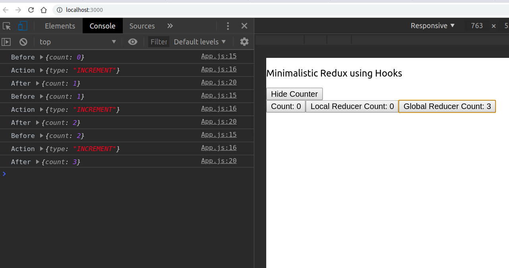

import { CodeSnippet }  from '../../../../components/code-snippet';

<iframe style="width:100%;height:60vmin;@media (max-width: 350px) {height:250px};background-color:white;" src="https://www.youtube-nocookie.com/embed/f37cS7DjYV8" frameborder="0" allow="accelerometer; autoplay; encrypted-media; gyroscope; picture-in-picture" allowfullscreen></iframe>

## Introduction
This blog post is inspired by <a href="https://medium.com/simply/state-management-with-react-hooks-and-context-api-at-10-lines-of-code-baf6be8302c"
target="_blank">another post</a>, that demonstrates the 10 line approach to building a state management system using React Hooks. 
Not that you should have an basic understanding of state management and context API within React to fully benefit from this post. 

## The Basics
### State Management (Redux)
The goal of a state management library is to make state easy to work with.
One of the main state management libraries for React is Redux. 
Redux uses actions from UI components to invoke change to the "global" application state. 
The action object flows through all the reducers in the application.
Different reducers listen for certain actions, consume the action object, and perform an operation on the globally shared state. 

When the global state changes, all components listening to the state, receive the change via props and re-render to reflect the change. 
Redux has a lots of support in terms of dev tools, middlewares, and extensions.
What I'm presenting is a simplification of using a state management system like  Redux but built entirely using React Hooks. 

### Context API
Context is not new to React. 
It has been around for a while. 
Behind the hood, Redux is using React's old Context API. 
The Context API is an alternative to passing down data via props from parent to child components. 
Context API differs from passing down props as it doesn't require the involvement of intermediate child components for passing data down the component hierarchy. 
It only requires specifying the data at a higher component, and consuming it any level below the higher component. 
Hence, Context API is suited for deeply nested component trees, as it reduces the tight coupling of the intermediate components that are not required to pass props that they themselves don't use.  

A single context consist of a single provider and any number of consumers. 
The provider wraps a component higher in the component tree and broadcasts a value down the component tree from the provider. 
The consumer is located lower in the component tree and accesses the provider's value. 
The provider holds no state of its own, but acts as a backdoor to pass data from higher up in the component tree to all the components underneath it. 
Adding the Context API can reduce reuse if the provider isn't high enough in the component tree. Also, it adds more complexity to the application. 

## Manage Global State in React Hooks
With a Redux implementation, a provider wraps the entry level components. Similarily, we can create our own implmentation of the Provider, that is really the React Context API in disguise. The value of this React Context API is the result of the *useReducer* React hook, which acts the global state and dispatch. 

Here is implementation of the provider object using React Hooks:

<CodeSnippet fileName="StateProvider.js">{`
import React, {createContext, useReducer} from 'react';\n
export let StateContext = createContext();\n
export const StateProvider = ({children, reducer, initialState}) => {
    let mainReducer = useReducer(reducer, initialState);
    return <StateContext.Provider value={mainReducer}>
        {children}
        </StateContext.Provider>
};
`}</CodeSnippet>

Here, we are creating and exporting the context using React's createContext API. 

<CodeSnippet fileName="StateProvider.js" dataLine="3">{`
import React, {createContext, useReducer} from 'react';\n
export let StateContext = createContext();\n
export const StateProvider = ({children, reducer, initialState}) => {
    let mainReducer = useReducer(reducer, initialState);
    return <StateContext.Provider value={mainReducer}>
        {children}
        </StateContext.Provider>
};
`}</CodeSnippet>

The next statement wraps the the children components, `children`, by the globally bound Context Provider. 

<CodeSnippet fileName="StateProvider.js" dataLine="7-9">{`
import React, {createContext, useReducer} from 'react';\n
export let StateContext = createContext();\n
export const StateProvider = ({children, reducer, initialState}) => {
    let mainReducer = useReducer(reducer, initialState);
    return <StateContext.Provider value={mainReducer}>
        {children}
        </StateContext.Provider>
};
`}</CodeSnippet>

Now, any component in `children` can import this context and get the global state and dispatch using the following statement:
<CodeSnippet>{`
const [state, dispatch] = useContext(<StateContext>);
`}</CodeSnippet>

Here's a really simple reducer we can use for input. The initialState can be
<CodeSnippet>{`
export const countReducer = (state, action) => {
    switch (action.type) {
        case 'INCREMENT':
            return state + 1;
        default:
            return state;
    }
};
`}</CodeSnippet>

Finally, in our `<App />` component, we can wrap our application using `StateProvider` and pass in the reducer and initialState.

<CodeSnippet fileName="App.js">{`
const App = () => {
    return <StateProvider reducer={countReducer} initialState={0}>
	    /* code */
    </StateProvider>
};
`}</CodeSnippet>

Now we import `StateContext` anywhere in the app, and get the global state to read data and invoke actions using the global dispatch.

<iframe src="https://codesandbox.io/embed/z377nwk433?fontsize=14&module=%2Fsrc%2FStateProvider.js" title="z377nwk433" style="width:100%; height:500px; border:0; border-radius: 4px; overflow:hidden;" sandbox="allow-modals allow-forms allow-popups allow-scripts allow-same-origin"></iframe>

## Middleware: Logger
If you're interested in building middleware for reducers (i.e. adding cross-cutting logic to all actions and state changes), you can simply add code to the main root reducer. Here's my example of mimicing the redux logger using our example from above:
<CodeSnippet>{`
const mainReducer = (state, action) => {
    console.log('Before', state);
    console.log('Action', action);
    let result = {
        count: countReducer(state.count, action)
    };
    console.log('After', result);
    return result
};
`}</CodeSnippet>
Here's what it looks like:

Note that I've composed the root reducer using the `countReducer` specified before, so the state related to this reducer will be contained in a slice called `count`. Now, every state change will invoke 3 `console.log`, which will output the before, action, and after information in the dev tools.
