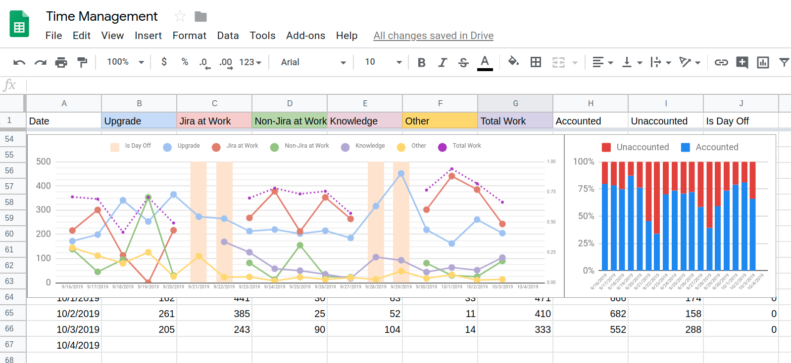

### Damage control
My wife will _hate_ me for writing this article. Why? Because I'm going to spend way too much time coding over the next year than usual. At least we're going on vacation for a few weeks starting today for our 2nd wedding anniversary.

### The Situation
Currently, I'm listening to [Ultralearning](https://www.amazon.ca/Ultralearning-Master-Outsmart-Competition-Accelerate/dp/1982662964) on Audible. This book is reemphasizing the importance for self-directed learning that's focused on building hard skills that deliver results. **Side projects** with hard deadlines and demanding deliverables are the key. I'm intending to use concepts from this book to drive a new cadence and approach of working on side projects. 

My current side project is my blog site, [Ortmesh](ortmesh.com), which has a hard, self-imposed deadline of October 15. But since I'm on vacation starting today, today is the last day I'm working on it. Now, it's time for a new project(s). 

So with this post, I'm setting myself up for a public experiement and building context for my future posts.
 
Now here's the plan.

### Step 1 of Ultralearning: Draw a Map

#### The What 
To really push myself, I'm going to complete **6 side projects in 12 months**. Over the next week, I will pick from the following list:

1. public facing API with a possible subscription model
2. launch a documentation website on a niche, relevant, and poorly-documented topic
3. build an e-commerce website that sells a niche product  
4. develop a React Native mobile app that has parity with the web app in #3
5. author a npm package and possibility promote it via documentation website
6. heavily contribute to an open source project I love (i.e. Gatsby)

The main issue will be to pick a specific problem to solve. That requires a bit of research and thought.

#### The Why 
 The goal of the side projects are to build skills that will further my career in software development. Getting a diverse set of very specialized skills isn't practical or demanding enough in any typical day job or school setting. They need to be intentionally sought out, practiced and applied to real world problems. Mastery is an amazing reward in itself.
 
 Besides the acquired skills, the side projects should provide real value as well. I want to adhere to Warren Buffet's [10/10/10 Rule](https://medium.com/the-mission/why-warren-buffetts-10-10-10-rule-will-help-you-make-smarter-decisions-43d63d5ea124), and build stuff that has potential now and in the future. This helps keep the project worthwhile in the face of setbacks, boredom, and priority conflicts.
 
As mentioned in the Ultralearning book, working through multiple projects improves **metalearning**. **This is learning how to learn anything and solve any problem in the best way possible**. This is perhaps the greatest outcome of this exercise. 

#### The How
_30 hours/week on the side project and 5 hours/week for posting articles._ I keep track. I really want to spend more than 30 hours/week but finding time is not easy. That's why I manage my time ruthlessly in the first place. I'm always looking for ways to increase this benchmark every week.      

Also, I will keep a Kanban board for each project, like I did for my blog. Thanks to a tip by [John Sonmez](https://app.pluralsight.com/profile/author/john-sonmez?aid=701j0000001heIqAAI), my productivity skyrocketed after using [KanbanFlow](https://kanbanflow.com/features). I use the timers to gauge my estimates vs actual time spend on tasks. 

### Concluding Remarks
Seeing the progress span over a year will be an interesting project in itself. I've set an ambitious goal for myself and I'm confident that my readers will learn from my experiences. I'm also looking forward to documenting the process and progressively seeing how my metalearning improves over time. 
