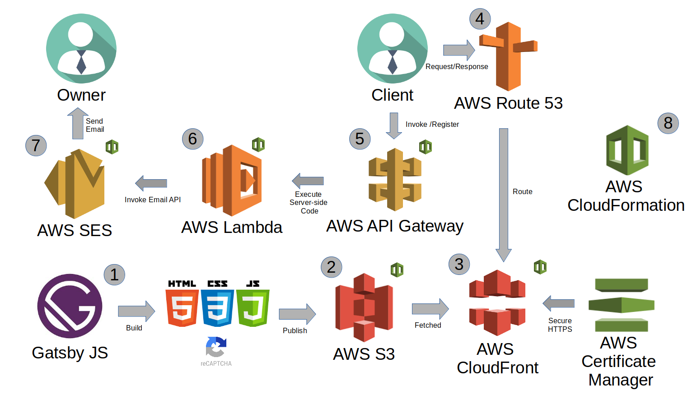

## Reference Architecture

Here, my goal is to develop fast, cheap, efficient way of building landing pages.
The following reference architecture diagram shows the current state of my side project.
I'm working on automating the last bits and introducing newer services to boost reliability.

1. Gatsby JS is a React-based static site generator. 
It allowed me to build landing pages quickly using a reusable component library, while giving me 100% control of the look and feel.

2. The build phase of GatsbyJS yields HTML/CSS/JS that's production ready.
Using AWS CLI and npm, I copy the build files to an AWS S3 bucket configured as a website.
AWS S3 (Simple Storage Service) allows for very cheap web hosting of static content.

3. AWS CloudFront allows me to scale the distribution of S3 content and adds security via HTTPS Certificate from AWS Certificate Manager.
Using a bucket policy, I restrict public access to S3 and force content fetching via CloudFront. 

4. Using Route 53, I register domains, host domains, and set http routing logic. 
Clients first hit Route 53, which then fetches the HTML/JS/CSS from CloudFront.

5. Using the client-side JavaScript, the client invokes a POST request via API gateway to register for the landing page offering.

6. Server-side code in AWS Lambda verifies the request for potential spam, using Google ReCaptcha, and then sends an email API request to AWS Simple Email Service (SES).

7. AWS Simple Email Service (SES) fires off an email using the mail domain (setup in Route 53) to the owner with relevant data.

8. Most of the cloud infrastructure is deployed programmatically using AWS CLI and AWS Cloudformation.
Future work involves automating deployment for Route 53, ACM, and some AWS SES dependencies.      