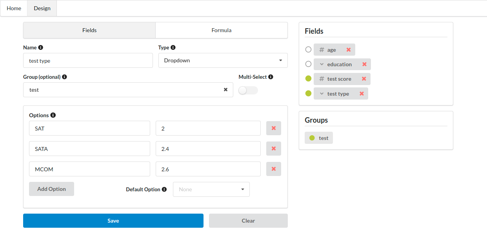
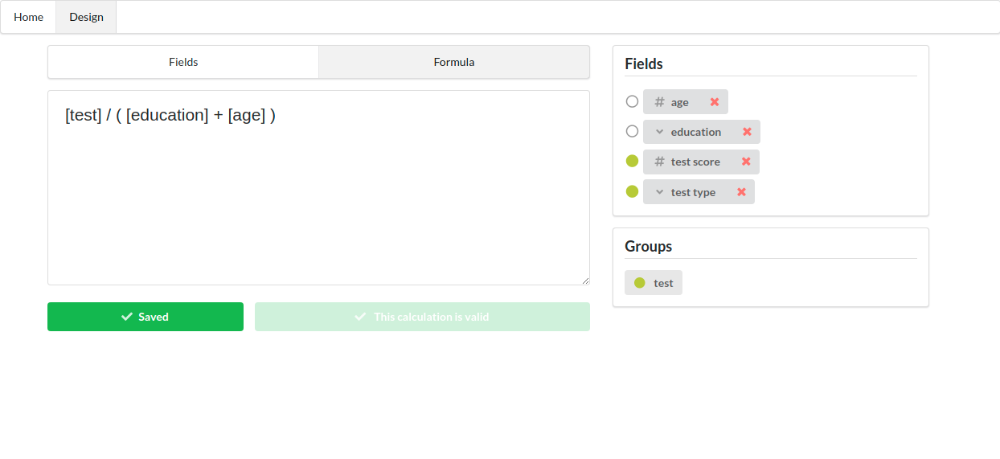
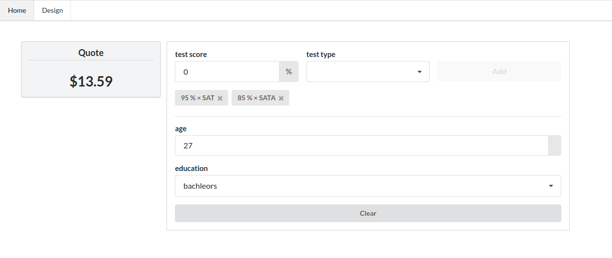

### Step 1: Create the fields

 
_Add weighted fields that influence the quote. 
There are 3 types of field: (1) number picker, (2) select dropdown, 
and (3) multi-select dropdown. Located: Designer > Fields._

### Step 2: Build a Formula

_Formulas are built using the fields specified from the prior step. Use math to compute how 
different fields impact the quote. Located: Designer > Formula._

### Step 3: Generate the Quotes

_Dynamically change the value of the fields to update the quote. Located: Home._